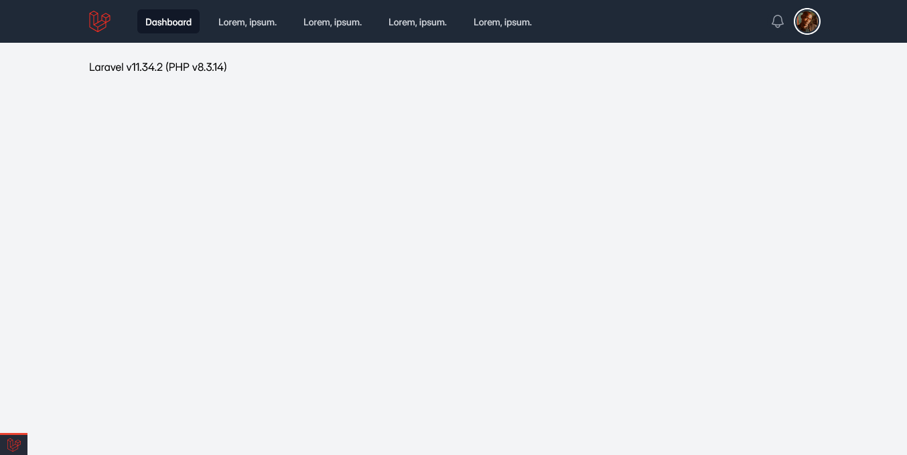

[](https://github.com/SantosVilanculos/laravel-boilerplate/actions)
[](https://github.com/SantosVilanculos/laravel-boilerplate/commits/main)
[](https://github.com/SantosVilanculos/laravel-boilerplate/blob/main/LICENSE)



```sh
chmod +x ./install.sh && ./install.sh
```
